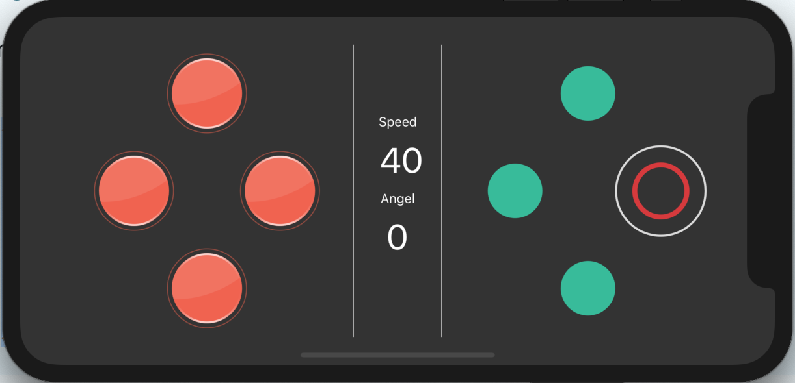

# RovX Gamepad

React Native based gamepad, joystick which can be used for RC projects. Integrates with RovX server. You can use this gamepad for your own project, if you need to customize it.


## Setup
We are not providing the release into any kind of store. It's a part of our roadmap. Until then:

You can clone the repository:

```
https://github.com/torabian/rovx-gamepad
```

and install dependencies:

```
npm install
```

For more information, you need to look at the "React Native" project guidelines from facebook. We do not eject their project, so all instructions there would work here as well.

**We are not using expo**




## Roadmap

- [ ] Create an initial working gamepad with https requests
- [ ] Implement joystick mode and advanced mode.
- [ ] Release on Google Play
- [ ] Release on AppStore
- [ ] Add bluetooth support

We keep rest of the information on github issues.

## License

This project is **free** of charge only if it's used:
  * For hobbyists, who want to make their own RC, or Arduino project
  * For single person usage, who needs to use it for personal purposes
  * Using it for training in electronic labs or universities.

A valid license should be aquired if:
  * You want to redistribute this project, or any of it's component into another project.
  * You want to upload it to any stores, in any country.
  * Or any case that owner did not mention to be free.

Tags:
React Native Joystick - Joystick with react native - Mobile Joystick - free mobile gamepad, Free Android Gamepad, Free IOS Gamepad